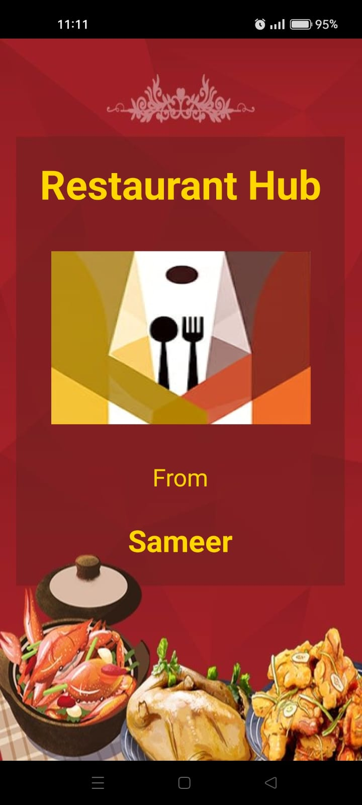
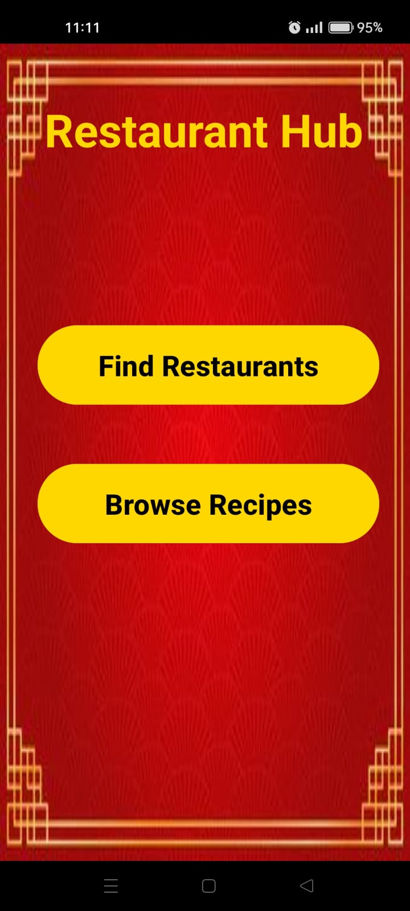
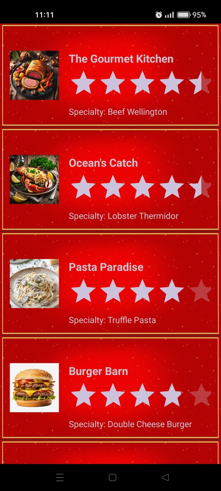
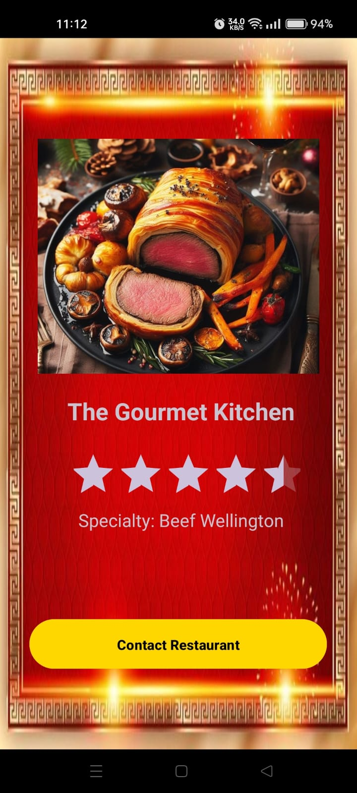
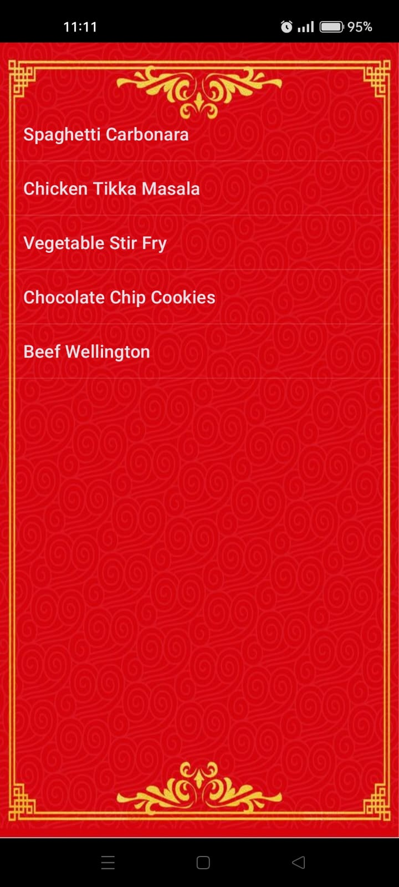
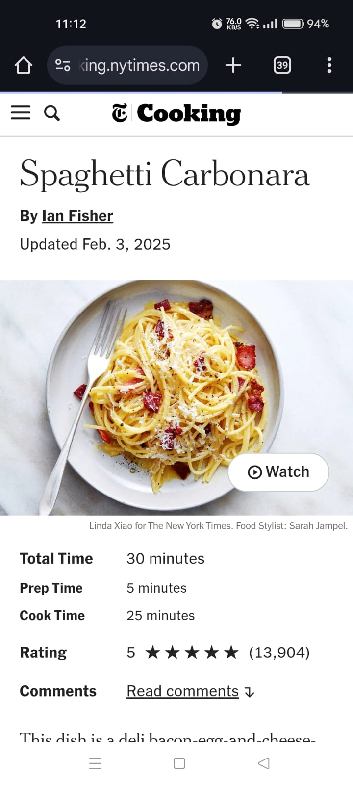
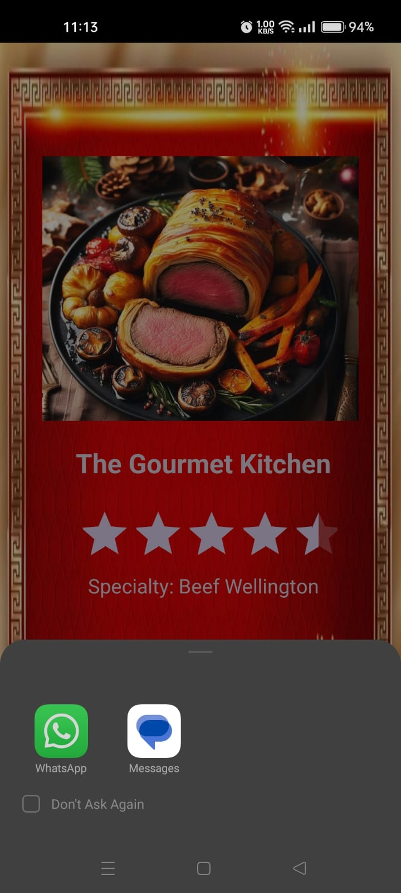

# 🍽️ Food Finder (Restaurant Hub)

**Food Finder** is a simple Android app built using **Java + XML** in Android Studio. It allows users to explore nearby restaurants and browse recipes with easy navigation between screens. The app demonstrates the use of **explicit and implicit intents**, **ListView**, and a clean UI/UX design.

---

## 📱 App Screenshots

| Splash Screen | Home Menu | Restaurant List | Restaurant Detail |
|---|---|---|---|
|  |  |  |  |

| Recipes List | Recipe Web Page | Share via WhatsApp |
|---|---|---|
|  |  |  |

---

## 🎯 Objective

Build a lightweight app to:
- Browse **local restaurants** using **explicit intents**
- Open **recipe web pages** using **implicit intents**
- Navigate smoothly between activities
- Demonstrate Android fundamentals like `ListView`, `Intents`, and `Splash Screen`

---

## 🔧 Features

### 1. **Splash Screen**
- Displays app logo and developer name
- Automatically navigates to Home screen after 2 seconds

### 2. **Home Activity (Main Menu)**
- Two main navigation buttons:
  - `Find Restaurants` → opens the restaurant list
  - `Browse Recipes` → opens the recipe list

### 3. **Restaurant List Activity**
- Displays a **ListView** of local restaurants with:
  - Name, image, rating, and specialty
- On click: opens detailed view using **explicit intent**

### 4. **Restaurant Details Activity**
- Shows full restaurant info
- Includes **"Contact Restaurant"** button:
  - Opens WhatsApp or messaging app using **implicit intent**

### 5. **Recipe List Activity**
- Displays a list of recipe names using `ListView`
- On click: opens the recipe website in a browser via **implicit intent**

---

## 🧪 Tech Stack

- **Language:** Java  
- **UI:** XML Layouts  
- **IDE:** Android Studio  
- **Concepts Used:**  
  - ListView  
  - Splash Screen  
  - Intents (Explicit & Implicit)  
  - Messaging/Sharing Intent  
  - Web Navigation  

---

## 🛠️ Setup Instructions

1. Clone the repository:
   ```bash
   git clone https://github.com/Sameer-3333/Restaurant_Hub1.git
   ```

2. Open the project in **Android Studio**

3. Run the app on an emulator or connected device.

> 📌 Make sure you have Android SDK and emulator setup correctly.

---

## 📄 License

This project is licensed under the **MIT License**.  
See the [LICENSE](./LICENSE) file for more details.

---

## 🙋‍♂️ Author

**Sameer Sherbaz**  
📧 Contact: [sameersherbaz9@gmail.com](mailto:sameersherbaz9@gmail.com)  
🔗 GitHub Repo: [Restaurant Hub](https://github.com/Sameer-3333/Restaurant_Hub1/tree/main)

---

## ⭐️ Show Your Support

If you like this project, please give it a ⭐️ on GitHub to help others discover it!
